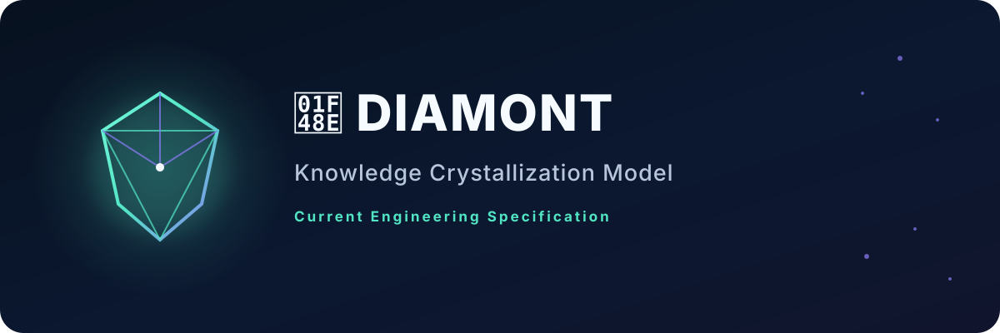
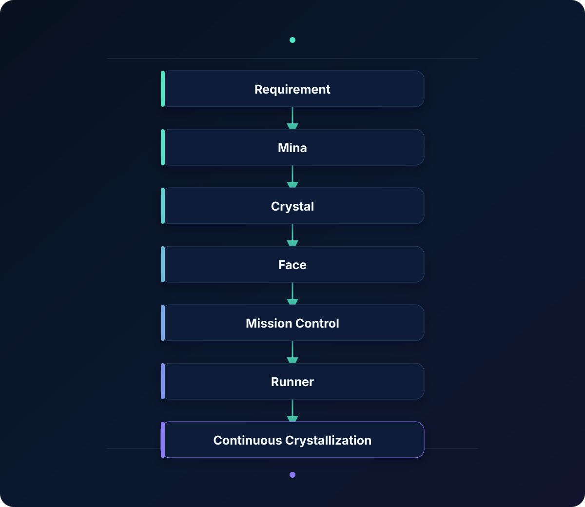
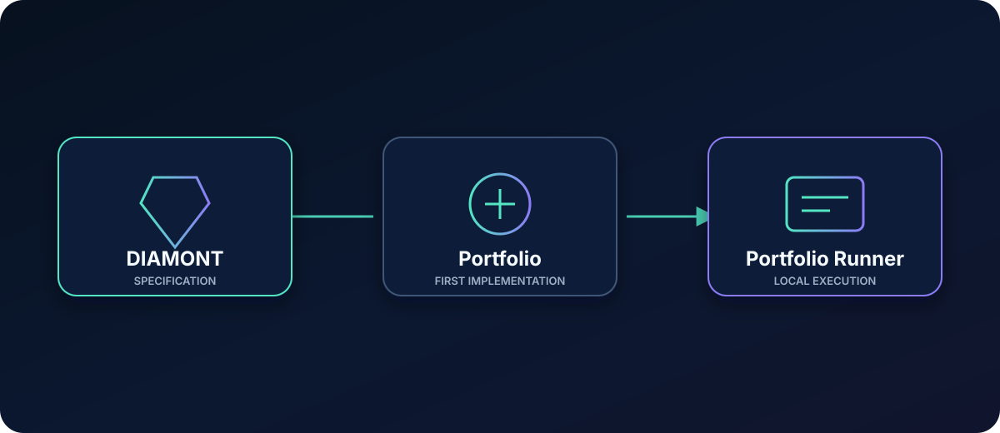

  

 

  <a href="#engineering-specification">Specification</a>&nbsp;&nbsp;·&nbsp;&nbsp;
  <a href="#engineering-model">Model</a>&nbsp;&nbsp;·&nbsp;&nbsp;
  <a href="#engineering-language">Language</a>&nbsp;&nbsp;·&nbsp;&nbsp;
  <a href="#engineering-components">Components</a>&nbsp;&nbsp;·&nbsp;&nbsp;
  <a href="#repository-map">Repositories</a>

 

## Engineering Specification

| Document | Responsibility |
|:--|:--|
| [Constitution](https://github.com/aledaas/diamont/blob/main/docs/CONSTITUTION.md) | Normative authority |
| [Foundation](https://github.com/aledaas/diamont/blob/main/docs/FOUNDATION.md) | Scope and research foundation |
| [Manifesto](https://github.com/aledaas/diamont/blob/main/docs/MANIFESTO.md) | Philosophical orientation |
| [Language](https://github.com/aledaas/diamont/tree/main/docs/language) | Current engineering vocabulary |
| [Discoveries](https://github.com/aledaas/diamont/tree/main/discoveries) | Evolving research record |
| [Research](https://github.com/aledaas/diamont/tree/main/research) | Studies, protocols, and experiments |

 

## Engineering Model

  

 

## Engineering Language

| Concept | Official Document |
|:--|:--|
| Software Factory | [Specification](https://github.com/aledaas/diamont/blob/main/docs/language/SOFTWARE_FACTORY.md) |
| Requirement | [Specification](https://github.com/aledaas/diamont/blob/main/docs/language/REQUIREMENT.md) |
| MINA | [Specification](https://github.com/aledaas/diamont/blob/main/docs/language/MINA.md) |
| Crystal | [Specification](https://github.com/aledaas/diamont/blob/main/docs/language/CRYSTAL.md) |
| Face | [Specification](https://github.com/aledaas/diamont/blob/main/docs/language/FACE.md) |
| Mission Control | [Specification](https://github.com/aledaas/diamont/blob/main/docs/language/MISSION_CONTROL.md) |
| Runner | [Specification](https://github.com/aledaas/diamont/blob/main/docs/language/RUNNER.md) |
| Orfebre | [Specification](https://github.com/aledaas/diamont/blob/main/docs/language/ORFEBRE.md) |
| Worker | [Specification](https://github.com/aledaas/diamont/blob/main/docs/language/WORKER.md) |
| Crystallization | [Specification](https://github.com/aledaas/diamont/blob/main/docs/language/CRYSTALLIZATION.md) |

 

## Engineering Components

| Component | Role | Continue |
|:--|:--|:--|
| 💎 DIAMONT | Engineering specification | [Open](https://github.com/aledaas/diamont) |
| ⛏ MINA | Requirement discovery | [Open](https://github.com/aledaas/diamont/blob/main/docs/language/MINA.md) |
| 💠 Crystal | Reusable engineering knowledge | [Open](https://github.com/aledaas/diamont/blob/main/docs/language/CRYSTAL.md) |
| ✨ Face | Crystal evolution | [Open](https://github.com/aledaas/diamont/blob/main/docs/language/FACE.md) |
| 🎯 Mission Control | Production visibility | [Open](https://github.com/aledaas/diamont/blob/main/docs/language/MISSION_CONTROL.md) |
| ⚙ Runner | Local execution | [Open](https://github.com/aledaas/diamont/blob/main/docs/language/RUNNER.md) |
| 👤 Orfebre | Human engineering role | [Open](https://github.com/aledaas/diamont/blob/main/docs/language/ORFEBRE.md) |
| 🤖 Worker | Artificial engineering role | [Open](https://github.com/aledaas/diamont/blob/main/docs/language/WORKER.md) |

 

## Engineering Domains

| Research Line | Status | Continue |
|:--|:--|:--|
| Web Administration | Research | [Study](https://github.com/aledaas/diamont/blob/main/research/studies/web-administration-solution-system.md) |
| Native Mobile Application | Research | [Study](https://github.com/aledaas/diamont/blob/main/research/studies/native-mobile-application-solution-system.md) |

 

## Production Stack

| Surface | Stack | Source |
|:--|:--|:--|
| Specification | Markdown · YAML · Git | [DIAMONT](https://github.com/aledaas/diamont) |
| First implementation | Laravel · Filament · PostgreSQL | [Portfolio](https://github.com/aledaas/development-portfolio) |
| Local execution | Go · Fyne · SQLite | [Portfolio Runner](https://github.com/aledaas/porfolio-runner) |

 

## Repository Map

  

| Repository | Responsibility | Continue |
|:--|:--|:--|
| DIAMONT | Official engineering specification | [Repository](https://github.com/aledaas/diamont) |
| Portfolio | First implementation of DIAMONT. | [Repository](https://github.com/aledaas/development-portfolio) |
| Portfolio Runner | Local execution | [Repository](https://github.com/aledaas/porfolio-runner) |

 

  <a href="https://github.com/aledaas/diamont"><strong>Enter the specification →</strong></a>

